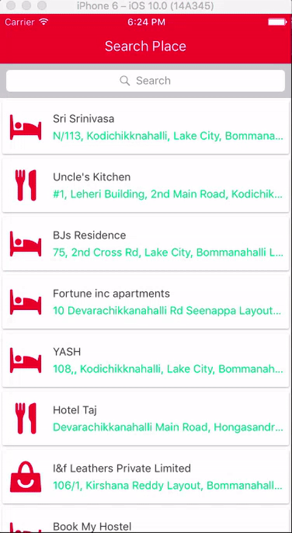

# react-native-places-autocomplete
React Native Google NearBy Place Search and Places Autocomplete (iOS/Android)

##Usage: 

When this component is loaded for the first time, it will show a list of NearBy Places.
Then, when you start typing, a list of merchants will be shown near your location (which is by default 500m radius).

```javascript
import PlacesAutoComplete from 'react-native-places-autocomplete'

var SearchBar = require('react-native-search-bar'); // Optional but recommended on iOS

export default class SearchPlace extends Component {
    constructor(props) {
        super(props);

        this.state = {}
    }

    render() {
        return (
            <View style={{flex: 1, marginTop: 64}}>
                <PlacesAutoComplete
                    apikey="YOUR_API_KEY"
                    rankby="distance"
                    radius="500"
                    type="restaurant|department_store|pharmacy|night_club|movie_theater|bowling_alley|book_store|meal_delivery|meal_takeaway|lodging|bar"
                    iconColor="#FC1D47"
                    merchantNameColor="#37383B"
                    searchText={this.state.searchText}
                    searchInput={
                        <SearchBar
                            ref='searchBar'
                            placeholder='Search'
                            onChangeText={text => {
                                console.log(text);
                                this.setState({searchText: text});
                            }}
                            onSearchButtonPress={()=> {
                            }}
                            onCancelButtonPress={()=> {
                            }}
                        />
                    }
                    onSelect={(details)=> { // When you select a merchant this will be triggered.
                        console.log(details);
                    }}
                />
            </View>
        );
    }
}
```

`NB: PRs are welcome`

Demo:

